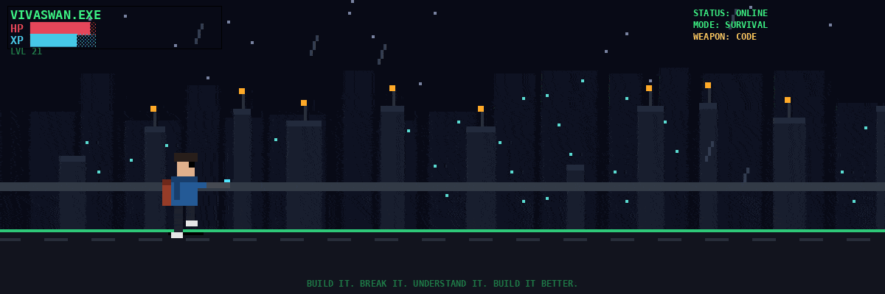
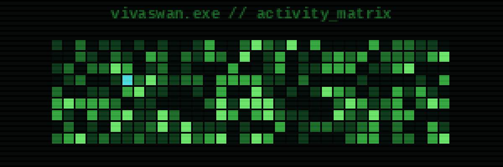

<h1 align="center">Hi, I'm Vivaswan Singh</h1>

  

<h2 align="center">ABOUT ME</h2>

  A Computer Science student at <b>UPES, Dehradun</b>, exploring
  <b>cybersecurity, systems, and problem solving</b>. 
  I work mainly with <b>C, Python, Rust, Java, Bash, PowerShell, Assembly, and SQL</b>,
  while constantly trying to understand what happens beneath the surface —
  from algorithms and software to vulnerabilities and how systems break. 
  Outside of code, I write stories and poetry, play sports, and build things
  simply because I'm curious enough to see where they lead. 
  Still learning. Still experimenting. Still looking for the next thing worth figuring out.

<h2 align="center">TECH STACK</h2>

  

<h3 align="center">💻 LANGUAGES</h3>

  
  
  
  

  
  
  
  

<h3 align="center">⚔️ CYBERSECURITY & CORE</h3>

  
  
  
  

<h3 align="center">🛠️ TOOLS & PLATFORMS</h3>

  
  
  
  

  
  
  
  

  
  
  
  

<h2 align="center">📡 CONTACT</h2>

  
  
  
  
  

  

